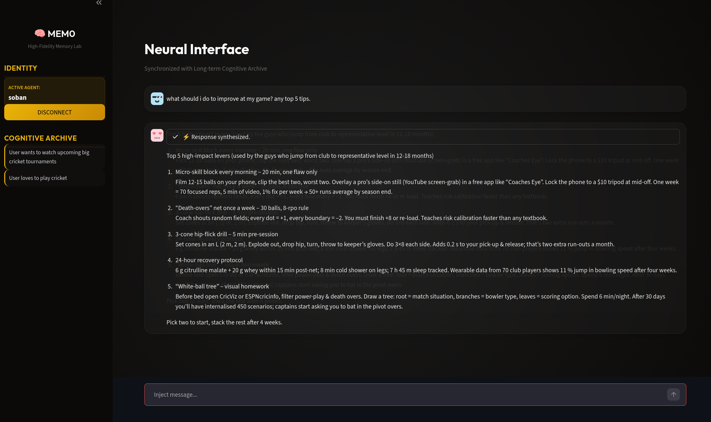

# Memory Chatbot

A Streamlit-based chatbot that uses Groq's MoonshotAI Kimi-K2-Instruct model and Mem0 for long-term memory. The bot remembers key facts about the user across conversations using name-based user identification.


## Features

- **Personalized Memory**: Remembers user details like name, preferences, work, and personal facts across sessions using Mem0.
- **Name-Based User Identification**: Each user enters their name to access their personalized memory space.
- **Cross-Session Persistence**: Memories persist across different sessions, devices, and browsers using the user's name as identifier.
- **AI-Powered Memory Classification**: Uses Groq's MoonshotAI Kimi-K2-Instruct to intelligently decide which user messages contain save-worthy facts (in `agentic_memory.py`).
- **Rule-Based Memory Fallback**: Simple keyword-based memory classification as an alternative (in `memory.py`).
- **MoonshotAI Kimi-K2-Instruct**: Powered by Groq's fast and efficient model for responses.
- **Contextual Conversations**: Retrieves relevant past memories to personalize responses.

## Project Structure

```
.
├── app.py              # Main Streamlit application
├── agentic_memory.py   # AI-powered memory classification using Groq
├── memory.py           # Rule-based memory classification (legacy)
├── requirements.txt    # Python dependencies
└── .env.example        # Environment variables template
```

## Setup

1. Clone the repository.

2. Install dependencies:
   ```bash
   uv sync
   ```

3. Copy `.env.example` to `.env` and add your API keys:
   ```bash
   cp .env.example .env
   ```

   Required environment variables:
   - `GROQ_API_KEY`: Get from [Groq Cloud](https://console.groq.com/)
   - `MEM0_API_KEY`: Get from [Mem0](https://app.mem0.ai/)

## Usage

Run the app:

```bash
uv run streamlit run app.py
```

For development with auto-reload:

```bash
uv run streamlit run app.py --server.runOnSave true
```


## How It Works

1. **User Identification**: The user enters their name to establish a unique identity for memory storage.
2. **User Input**: The user sends a message through the Streamlit chat interface.
3. **Memory Retrieval**: Relevant past memories are retrieved from Mem0 based on the current message and user ID.
4. **Contextual Response**: The MoonshotAI Kimi-K2-Instruct model generates a response using the retrieved memories as context.
5. **Memory Storage**: After responding, the message is analyzed to determine if it contains a fact worth storing for future conversations.

## Memory Classification

The bot uses one of two approaches to decide what to remember:

- **AI-Powered** (`agentic_memory.py`): Uses Groq's MoonshotAI Kimi-K2-Instruct model to classify whether a message contains a stable, user-specific fact worth remembering. This handles complex cases and avoids storing sensitive information.

- **Rule-Based** (`memory.py`): Uses keyword matching to identify important facts. Simpler and faster but less nuanced.

The main app (`app.py`) currently uses the AI-powered approach for better accuracy.
